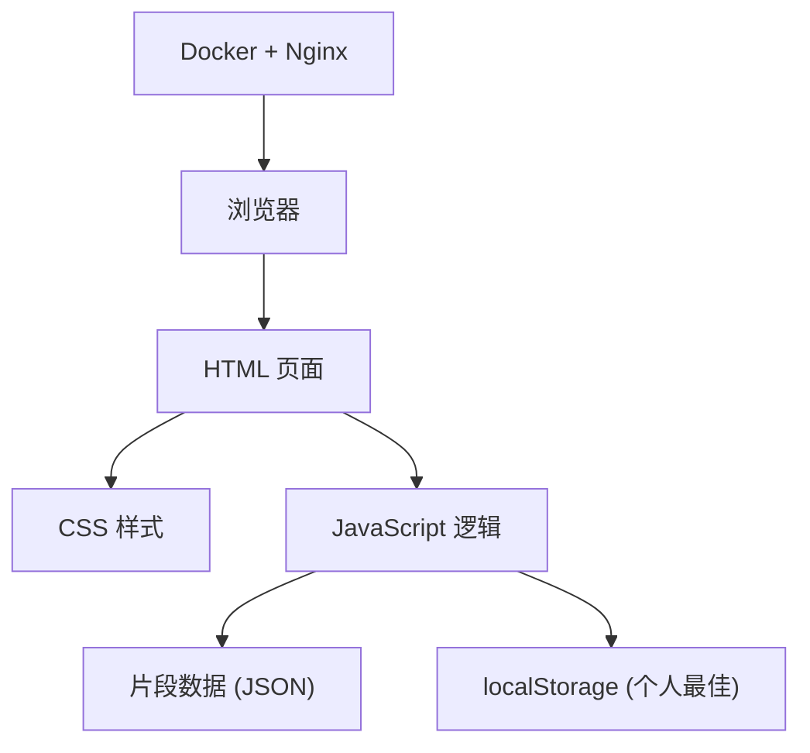

## 1. 架构设计

纯前端静态应用，无后端服务，所有逻辑在浏览器端执行。数据存储使用 localStorage。



## 2. 技术描述

- **前端技术栈**：纯 HTML5 + CSS3 + Vanilla JavaScript（无框架）
- **静态资源服务**：Nginx (Docker 容器)
- **数据存储**：localStorage 存储个人最佳 streak
- **动画技术**：CSS Animation + requestAnimationFrame + SVG
- **构建部署**：Docker 多阶段构建，静态文件直接由 Nginx 提供

## 3. 项目结构

```
/
├── index.html              # 主页面
├── css/
│   └── style.css           # 样式文件
├── js/
│   ├── app.js              # 核心逻辑
│   └── data.js             # 示例片段数据
├── Dockerfile              # Docker 构建配置
├── nginx.conf              # Nginx 配置
└── README.md               # 使用说明
```

## 4. 数据结构定义

### 4.1 训练片段数据结构

```javascript
interface SegmentData {
  id: string;
  name: string;
  description: string;
  duration: number;           // 总时长（秒）
  rpmCurve: RpmPoint[];       // 目标转速曲线
  checkpoints: Checkpoint[];  // 按键检查点
}

interface RpmPoint {
  time: number;   // 时间点（秒）
  rpm: number;    // 目标 RPM
}

interface Checkpoint {
  startTime: number;  // 该 RPM 段开始时间
  endTime: number;    // 该 RPM 段结束时间
  targetRpm: number;  // 目标 RPM
}
```

### 4.2 实时状态数据结构

```javascript
interface PlayerState {
  isPlaying: boolean;
  currentTime: number;
  currentRpm: number;
  targetRpm: number;
  streak: number;
  bestStreak: number;
  consecutiveBreaks: number;
  judgments: Judgment[];       // 所有判定记录
  segmentStats: SegmentStat[]; // 各段统计
}

interface Judgment {
  time: number;
  targetRpm: number;
  actualRpm: number;
  deviation: number;     // 偏差百分比
  result: 'steady' | 'drift' | 'break';
  segmentIndex: number;
}

interface SegmentStat {
  index: number;
  targetRpm: number;
  totalChecks: number;
  steadyCount: number;
  steadyRatio: number;
  avgDeviation: number;
}
```

## 5. 核心算法

### 5.1 RPM 插值计算

根据时间点在 rpmCurve 中线性插值得到当前目标 RPM：

```
function getTargetRpm(time): number
  - 找到 time 所在的两个相邻 RpmPoint
  - 线性插值计算当前 RPM
```

### 5.2 判定算法

```
function judge(actualRpm, targetRpm): Judgment
  deviation = |actualRpm - targetRpm| / targetRpm * 100
  if deviation ≤ 8: result = 'steady'
  else if deviation ≤ 18: result = 'drift'
  else: result = 'break'
```

### 5.3 Streak 更新逻辑

```
function updateStreak(judgment): void
  if judgment.result === 'steady':
    streak += 1
    consecutiveBreaks = 0
  else if judgment.result === 'drift':
    consecutiveBreaks = 0
  else:  // break
    consecutiveBreaks += 1
    if consecutiveBreaks >= 3:
      streak = 0
      consecutiveBreaks = 0
  bestStreak = max(bestStreak, streak)
```

## 6. 性能优化

- 使用 `requestAnimationFrame` 处理动画循环
- SVG 曲线预渲染，运行时仅更新标记点
- 节流处理高频按键事件
- 避免频繁 DOM 操作，使用 DocumentFragment 批量更新
