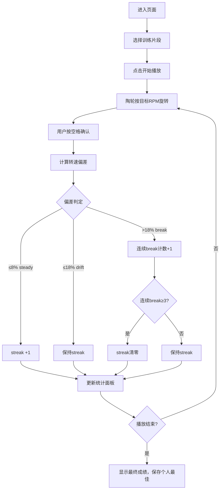

## 1. 产品概述

制陶拉坯转速节拍对照训练工具，帮助陶艺学员在拉坯过程中对照目标转速曲线，通过按键确认节奏，训练稳定控制陶轮转速的能力。无后端依赖，纯静态页面，支持 Docker 部署。

- 核心价值：将抽象的转速控制转化为可视化的节奏训练，帮助学员建立肌肉记忆
- 目标用户：陶艺初学者、拉坯技法练习者

## 2. 核心特征

### 2.1 用户角色
| 角色 | 注册方式 | 核心权限 |
|------|----------|----------|
| 学员 | 无需注册 | 使用训练功能、查看个人最佳成绩 |

### 2.2 功能模块
1. **主训练页面**：陶轮动画、转速曲线、进度条、评分展示
2. **数据面板**：streak 统计、各段 steady 占比、平均偏差、个人最佳
3. **播放控制**：开始/暂停/重置、片段选择

### 2.3 页面详情
| 页面名称 | 模块名称 | 功能描述 |
|----------|----------|----------|
| 训练主页 | 陶轮动画区 | 显示旋转的陶轮视觉效果，转速对应目标 RPM |
| 训练主页 | 转速曲线区 | 绘制目标 RPM 曲线，实时标记当前位置和判定结果 |
| 训练主页 | 进度条区 | 模拟时间轴，显示播放进度和按键标记点 |
| 训练主页 | 数据统计区 | 展示当前 streak、各段 steady 占比、平均偏差、个人最佳 |
| 训练主页 | 控制面板 | 播放/暂停/重置按钮、片段选择器 |

## 3. 核心流程

用户进入页面 → 选择训练片段 → 点击开始 → 陶轮随时间按目标 RPM 旋转 → 用户在对应 RPM 段内按空格键确认 → 系统实时判定（steady/drift/break）→ 更新 streak 和统计数据 → 播放结束显示最终成绩 → 个人最佳存入 localStorage

## 4. 用户界面设计

### 4.1 设计风格
- **主色调**：陶土赭石色 `#B5651D`、米色 `#F5F0E1`、深棕色 `#3D2914`
- **辅助色**：steady 绿色 `#2E7D32`、drift 琥珀色 `#F57C00`、break 红色 `#C62828`
- **字体**：标题用 "Playfair Display" 优雅衬线字体，正文用 "Lato" 清晰无衬线字体
- **视觉效果**：陶轮旋转动画、转速曲线平滑绘制、渐变背景带陶土颗粒质感

### 4.2 页面设计概述
| 页面名称 | 模块名称 | UI 元素 |
|----------|----------|----------|
| 训练主页 | 陶轮动画区 | 圆形陶轮，旋转速度对应 RPM，中心凸起，陶土纹理 |
| 训练主页 | 转速曲线区 | SVG 折线图，横轴时间，纵轴 RPM，不同颜色标记判定结果 |
| 训练主页 | 进度条区 | 线性进度条，分段显示 RPM 区间，按键标记点 |
| 训练主页 | 数据统计区 | 大数字展示 streak，环形图展示 steady 占比，偏差数值 |
| 训练主页 | 控制面板 | 圆角按钮，悬停动效，片段下拉选择 |

### 4.3 响应式
- Desktop 优先设计，左侧陶轮动画，右侧数据面板
- 移动端自适应堆叠布局，陶轮在上，数据在下
- 触摸设备优化空格键为大尺寸虚拟按钮

### 4.4 动画与交互
- 陶轮根据 RPM 实时调整旋转速度
- 按键确认时陶轮闪烁对应判定颜色
- streak 变化时有数字跳动动画
- 页面加载时元素依次淡入

